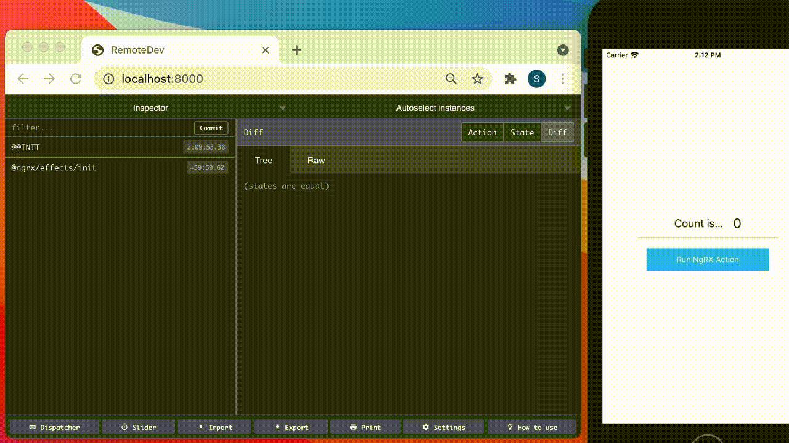

# NG-NGRX Remote Devtool _( NG11 - NS 7 Only)_

Example of how to send ngrx action and state to a remote Redux devtool server. It works with Android/IOS Simulators or with a real phone.
It's way better than using [ngrx-devtools-nativescript](https://github.com/vakrilov/ngrx-devtools-nativescript#readme)

## Caveats

> **Use NPM 6.x and Node 14**.  If you use NPM 7.x and Node 15 it will fail to compile properly. not sure why.

## Setup

### Setup a Remote Redux DevTool server

On your laptop download the [Remote Redux Devtool software](https://github.com/zalmoxisus/remote-redux-devtools).
The instructions say to install it in your global NPM directory but I opted to run it locally and bind the server to all network ports. Localhost and the laptop's IP. I can test with a real phone by pointing to the laptop's inside network address. I assume you are behind a firewall :)

```
npm install
./bin/remotedev.js --hostname 0.0.0.0
```

Go to [http://localhost:8000](http://localhost:8000). You should see the standard redux monitoring screen.


## Setup this repo

This repo assumes that you are using a simulator. The setting is in environment.ts. Change it to your Laptop's IP if you want to use a real phone.

#### src/environments/environment.ts (default)

```
export const environment = {
  production: false,
  backendUrlHost: isAndroid? '10.0.2.2' : 'localhost'
};
```

#### src/environments/environment.ts (testing with a real phone)

```
export const environment = {
  production: false,
  backendUrlHost: '192.168.1.10' // just an example
};

```

### Compile the repo
```
npm install
ns run android OR ns run ios
```

When the app is loaded click on the `Run NgRx Action` button and view the action and current state in the Redux monitoring view in the web browser.


## How it works

Credit to [@eduresponi](https://github.com/edusperoni/ngrx-ns) and others for creating the package found in `./lib`. I made a few changes to it make it work with NS7.

The main change was 'REDUX_DEVTOOLS_EXTENSION' should be. It was not what @eduresponi had his code.
Got by running `grep REDUX_DEVTOOLS_EXTENSION` code in `node_modules/@ngrx/store-devtools`. I assume for future @ngrx/store-devtools that line will be different.

#### lib/src/lib/module.ts

```
import './remotedev/patch';
import { ModuleWithProviders, NgModule } from '@angular/core';
import { ɵh as REDUX_DEVTOOLS_EXTENSION,  StoreDevtoolsModule } from '@ngrx/store-devtools';
....
.......
```


Then as recommended I added this magic line to `webpack.config.js`.

```

config.plugins.push(new webpack.NormalModuleReplacementPlugin(/^ws$/, "nativescript-websockets"));

```

It would be a great thing is someone else would package this into a proper plugin.

I tried to get it work with NS8 but there is a webpack interop issue between the webpack angular-compiler code and NS8 webpack. I think we have to wait until NS8 supports NG12. I believe NG12 supports webpack 5 and NG11 supports webpack 4.

## Demo
.
